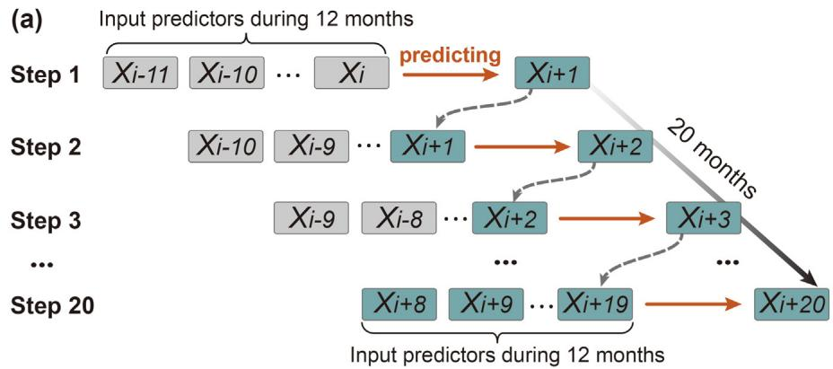
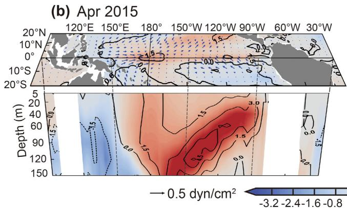
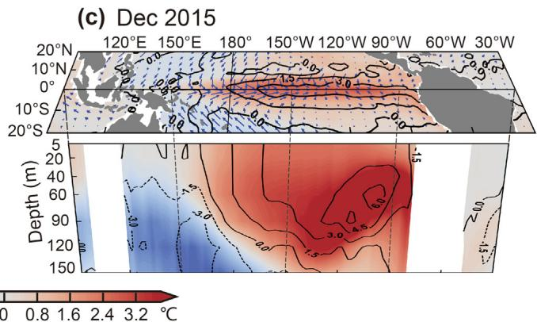
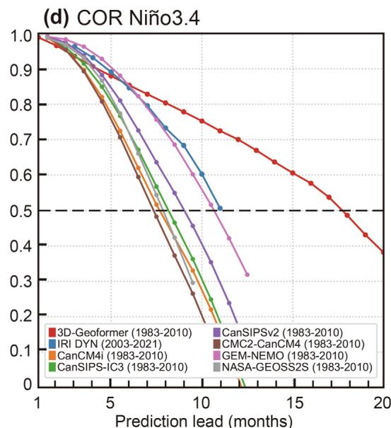
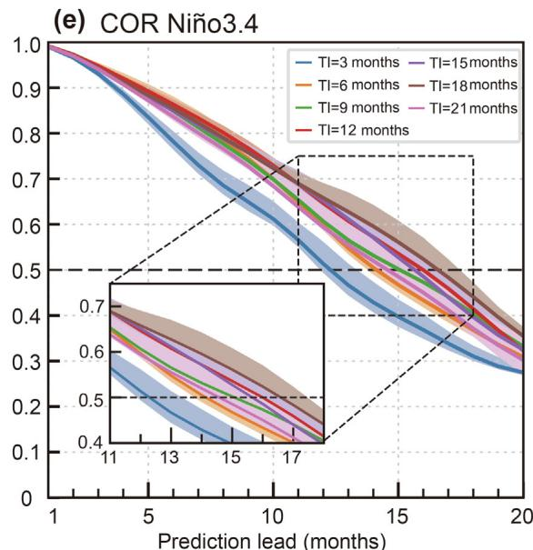

See discussions, stats, and author profiles for this publication at: https://www.researchgate.net/publication/380049844

# A transformer-based coupled ocean-atmosphere model for ENSO studies

Article  in  Science Bulletin · April 2024

DOI: 10.1016/j.scib.2024.04.048

CITATIONS 15

4 authors:

Rong‐Hua Zhang

Nanjing University of Science and Technology

211 PUBLICATIONS   5,610 CITATIONS

SEE PROFILE

Chuan Gao

Institute of Oceanology, Chinese Academy of Sciences,Qingdao

42 PUBLICATIONS   971 CITATIONS

SEE PROFILE

READS 839

Lu Zhou

Nanjing University of Information Science and Technology

10 PUBLICATIONS   253 CITATIONS

SEE PROFILE

Lingjiang Tao

Nanjing University of Information Science and Technology

26 PUBLICATIONS   223 CITATIONS

SEE PROFILE

Perspective

# A transformer-based coupled ocean-atmosphere model for ENSO studies

Rong-Hua Zhang a,⇑ , Lu Zhou b,c , Chuan Gao b,d,⇑ , Lingjiang Tao a

a School of Marine Sciences, Nanjing University of Information Science and Technology, Nanjing 210044, China   
b Key Laboratory of Ocean Observation and Forecasting and Key Laboratory of Ocean Circulation and Waves, Institute of Oceanology, Chinese Academy of Sciences, Qingdao 266071, China   
c University of Chinese Academy of Sciences, Beijing 101408, China   
d Laoshan Laboratory, Qingdao 266237, China

The El Niño-Southern Oscillation (ENSO) is the strongest interannual anomalies affecting weather and climate worldwide. As has been well recognized, ENSO originates from the coupling between the ocean and atmosphere in the tropical Pacific, characterized by a coherent evolution of subsurface temperature anomalies that profoundly impact sea surface temperature (SST) and surface wind fields. These interactions provide long-term memories pivotal for ENSO predictability. Physics-based ocean–atmosphere coupled models have been developed to explicitly capture these processes and have been widely used for ENSO modeling studies.

Moreover, physics-based dynamic models have proven successful in predicting ENSO events, including SST anomalies in the equatorial Pacific [1,2]. However, significant limitations persist in their real-time predictions [3,4]. Notably, previous modeling studies based on dynamic models indicate that the predicted amplitudes of SST anomalies in the central and eastern equatorial Pacific are widely spread across different models, manifesting substantial intermodal differences and uncertainty in ENSO predictions. Extensive efforts have been invested in improving prediction skills of ENSO, including data assimilation to procure accurate initial conditions for effective preconditioning in its future predictions. Nevertheless, effectively improving ENSO prediction skills in a timely manner remains a formidable challenge using physics-based models.

In recent years, deep learning (DL)-based modeling has made significant strides in earth sciences [5–9]. For example, DL-based models have been demonstrated to outperform dynamic models in terms of ENSO prediction as indicated by a simple ENSO index [7]. Moreover, DL-based models have successfully extended predictions to encompass multivariate ocean-atmosphere fields [8]. However, current DL-based models are constructed in a manner where end-to-end relationships between input predictors and output predictands are derived without explicit processes involved; thus, the ocean-atmosphere coupling inherent in ENSO processes in the tropical Pacific is not adequately represented during model construction and predictions.

More recently, a novel attention-based transformer model, named the 3D-Geoformer, has been developed for ENSO-related multivariate predictions, and it has several striking characteristics [9]. Scientifically, several key fields that are important to ENSO dynamics in the tropical Pacific are selected for both the input and output fields, including three-dimensional (3D) upper-ocean temperature fields and surface winds, respectively; currently, total 9 fields are used for ocean temperature in the upper $1 5 0 ~ \mathrm { m }$ , and zonal and meridional surface wind stress. Additionally, a soughtafter transformer framework [10] is adopted to depict coherent multivariate coupling between the ocean and atmosphere in the tropical Pacific. Therefore, this purely data-driven transformer model is configured to explicitly and adequately represent oceanatmosphere interactions vital to ENSO, akin to those in dynamic models. Technically, within the 3D-Geoformer architecture, a specific time-space self-attention mechanism is integrated into the model configuration, which allows to effectively capture nonlocal interactions by learning the interactions between input predictors and output predictands. Moreover, the prediction procedure is executed in a rolling manner similar to dynamic models. Specifically, Fig. 1a shows the prediction procedures using the 3D-Geoformer to derive 20-month output fields from 12-month input predictors. Here, anomalies during 12 months prior to the prediction target month are consequently used as initial conditions, from which the first-month prediction is made; then, the predicted fields for this month are used as the input predictor to form new multi-month input fields for making the next-month prediction. This procedure continues until all 20-month predictions are completed, ensuring a coherent prediction system within the context of DL-based framework. Ultimately, the 3D-Geofomer is constructed to possess the capability of predicting multivariate 3D fields, making a significant breakthrough in ENSO predictions from time series (single spatial point) to three-dimensional upper-ocean temperature fields. Consequently, the 3D-Geoformer, with monthto-month coupled relationships between the ocean and atmosphere represented for the input predictors and output predictands, emerges as a new modeling tool for ENSO studies.

After its construction as a powerful modeling tool, the 3D-Geoformer can have a variety of applications [9,11]. One immediate need coming up in mind is to demonstrate the extent to which

  
Fig. 1. (a) A rolling predictive procedure in which the 3D-Geoformer is used to make predictions on a monthly coupling basis; the numbers marked with X indicate sequential time steps (in months). At each prediction step (month), the 3D-Geoformer takes all the information for the input predictors during the previous 12 months and makes predictions for the following twenty consecutive months. For example, in the first row, consecutive 12-month predictor fields for $X _ { i - 1 1 } ,$ , Xi-10, . . ., Xi are used to make a nextmonth prediction for $X _ { i + 1 }$ ; in the second row, the predicted $X _ { i + 1 }$ is combined with the previous $X _ { i - 1 0 } ,$ , . . ., Xi to form new 12-month input predictors and make another nextmonth prediction for $X _ { i + 2 }$ . This procedure continues until all 20-month predictions are completed. (b) An example of 1-month-lead multivariate predictions made for April 2015 from initial condition in March 2015 using the 3D-Geoformer: the upper panel shows surface wind stress (vectors) and SST anomalies (shading) in the horizontal sections; the lower panel shows upper-ocean temperature (shading) anomalies at the equator in the vertical-zonal sections. Also, the GODAS reanalysis SST and upper-ocean temperature anomalies are superimposed on the panels as contours for comparisons. The contour interval is $1 . 5 ~ \mathrm { { ^ \circ C } }$ for the GODAS results and the color bar is for the 3D-Geoformer results. (c) Same as in (b), but for 9-month-lead multivariate predictions made for December 2015 from initial condition in March 2015, with the GODAS reanalysis in December 2015 also superimposed. (d) A comparison for the all-season correlation skill (COR) of the 3-month running mean Niño3.4 index predicted among the 3D-Geoformer $\mathrm { T I } = 1 8$ ; red line), dynamic model predictions from CPC/IRI (illustrated as the multi-model ensemble mean in blue line), and the individual models from the North American Multi-Model Ensemble (NMME; represented by various colored lines). The COR is calculated at different lead times (months). The testing period is indicated in the legend. (e) Sensitivities of prediction skills for the Niño3.4 index to various TI values obtained using the 3D-Geoformer. The all-season COR during the testing period of 1983– 2021 are assessed as a function of prediction lead months. The shading around each solid line denotes the $9 5 \%$ confidence interval, based on the bootstrap method. Here, the model makes predictions from the input predictor to derive the output predictands with different TI values ranging from 1 to 20 months.

ENSO prediction skills can be effectively improved by using this new transformer model, relative to other DL-based models and dynamic models. To this end, the following specific questions can be addressed by performing sensitivity experiments to quantify the effects of various model settings on prediction skills of SST in the eastern equatorial Pacific. For example, are there any optimal time intervals (TIs) by which more information on surface wind and thermal fields can be included to achieve the possibly highest prediction skills for SST in the eastern equatorial Pacific? When making predictions from the input predictors to the output predictands, which input predictor fields (surface winds or upper-ocean temperature fields) are more effective in terms of their effects on improving prediction skills of the SST? What are the relative contributions of surface wind and upper-ocean thermal fields to improving ENSO prediction skills? Which are sensitive regions where input predictor fields can have large effects on prediction skills of SST in the eastern equatorial Pacific? Clearly, addressing these issues helps not only understand where predictability comes from in the 3D-Geoformer, but also explain why the model can have the demonstrated good performance, thus enhancing explainability in the DL-based modeling context.

In the subsequent sections, we utilize this new 3D-Geoformer to showcase various applications for ENSO studies, leveraging its inherent advantages. One notable advantage is its ability to adequately represent the ocean–atmosphere coupling in the DL-based modeling framework, akin to physics-based modeling. Multiple oceanic and atmospheric fields representing the inherent coupling relevant to ENSO dynamics are incorporated, allowing for anomaly exchanges between the ocean and atmosphere on a month-bymonth basis during the training and predicting processes. Specifically, given the 9 fields as the input predictors during multi-month intervals serving as initial conditions, the same 9 fields are derived as the output predictands in a rolling manner from the 3D-Geoformer. Illustrative examples, such as those depicted in Fig. 1b and c for predictions during the 2015–2016 period, highlight the model’s capability to generate 20-month predictions in a rolling manner consequently from March 2015 to November 2016. The predicted details of oceanic and atmospheric conditions for Apr. 2015 and Dec. 2015 are shown in Fig. 1b and c. Here, during each month prediction from the predictors to predictands, the input and output fields are updated monthly, facilitating anomaly exchanges between the ocean and atmosphere. Consequently, the model accurately represents the corresponding ocean–atmosphere coevolutions and interactions over time. As shown, during the 2015–2016 El Niño event, warm subsurface anomalies notably propagated from west to east along the equator during the onset and development stages; their arrivals to the east induced warm SST anomalies over the eastern equatorial Pacific, which, in due course, compelled surface westerly wind anomalies in the western and central regions. In particular, ocean-atmosphere interactions inherently represented in the model lead to rapid amplifications of SST anomalies through late spring and summer predictions. Hence, the model effectively depicts anomaly conditions in December 2015 at a lead time of 9 months, including SST, surface wind, and upper-ocean temperature (Fig. 1c). These outcomes underscore the model’s ability to explicitly and adequately represent ENSO-related positive and negative feedbacks between the ocean and atmosphere. Evidently, this transformer-based prediction model is able to produce ENSO-related 3D thermal fields in the upper ocean of the tropical Pacific and its covarying evolution with SST and surface winds over time, being adequately designed to consider ENSO-related interactions.

The unique advantages offered by this new type of DL-based model are used to demonstrate its capability to improve prediction skills for ENSO. Retrospective hindcast experiments during longer periods indicate that this model outperforms the other state-of-

the-art dynamic models (Fig. 1d). A comparison from retrospective hindcasts is presented for the all-season correlation skill (COR) of the 3-month running mean Niño3.4 index predicted among the 3D-Geoformer (the TIs is taken to be 18), dynamic model predictions from CPC/IRI [3], and the individual models from the North American Multi-Model Ensemble (NMME) [4]. Note that the 3D-Geoformer actually produces 3D temperature fields in the upper ocean and surface winds (e.g., Fig. 1b and c); we calculate the Niño3.4 SST index from the produced 3D temperature anomalies for analyses in the figure. It is evident from the results that the DL-based model, solely trained with data from the tropical Pacific and CMIP6 products, perform remarkably well in predicting ENSO, apparently surpassing other conventional statistical and dynamic models.

Another example is used for ENSO predictability studies from initial condition perspective. In terms of initial conditions for predictions, one striking advantage is that the 3D-Geoformer is able to include more information on oceanic and atmospheric states during multi-month TIs in the input predictors serving as initial conditions, from which the output predictions are derived; this TI parameter acts to determine how much information is retained in the input fields serving as initial conditions. Generally, including more information on 3D temperature and surface wind fields during long TIs tends to precondition the future evolution more effectively, thus acting to enhance predictability for SST in the tropical Pacific; different values of TIs for the input fields can be used in the 3D-Geoformer, say taking $\mathrm { T I } = 1 2$ months as indicated in Fig. 1a. In addition, the values of TIs can be tuned for their optimal uses so that the possibly highest prediction skills of SST in the central and eastern equatorial Pacific can be achieved. These arguments are supported by performing sensitivity experiments to show dependences of the prediction skills for the Niño3.4 index on TIs (Fig. 1e). Taking $\mathrm { T I } = 1 2$ months is considered as a reference experiment (Fig. 1a). That is, information on surface wind and thermal fields during consecutive 12-month is used in the input predictors serving as initial conditions, from which the next 20-month predictions are made. Then, we perform sensitivity experiments by taking various TI values, ranging from 3 to 21 months; predictions are then made with different lead times, ranging from 1 to 20 months. Then, the effects on prediction skills of SST in the eastern equatorial Pacific are quantified relative to the reference experiment. When taking $\mathrm { T I } = 3$ months, the effective prediction lead times are about 12 months when using the correlation coefficients of 0.5 as a criterion. When taking longer TIs, more information on surface winds and thermal fields are taken into account in the initial conditions, which acts to constrain the future evolution more effectively. As expected, when taking longer TIs, prediction skills for SST in the eastern equatorial Pacific tend to be enhanced. We can see that effective prediction lead times are extended from 12 months at $\mathrm { T I } = 3$ to 16 months at $\mathrm { T I } = 1 2$ using this transformer model. The model performs best when taking $\mathrm { T I } = 1 8$ months with a saturation in prediction skills being reached. Then, further increases in TIs offer marginal benefits to the prediction skills. These results clearly indicate that there exists a saturation in the prediction skills when using preconditioning information on surface wind and thermal fields for ENSO predictions. This can be attributed to the fact that when long TIs are taken with more information on the oceanic and atmospheric states being represented, more noise can also be taken into account in the input predictors, which can compromise the skills. Also note that the maximum prediction skills obtained when taking $\mathrm { T I } = 1 8$ months may indicate that they have approached the upper limit of ENSO predictability [12]. Clearly, certain amounts of information on wind and thermal fields during long TIs are needed to achieve high prediction skills. Here, the 3D-Geoformer is demonstrated to have its unique advantages that can be taken to improve prediction skills, including a

way to use multi-month information in the input predictors serving as initial conditions. It is essential to highlight that the 3D-Geoformer allows for the inclusion of multi-month input fields as initial conditions, which act to precondition the future prediction. In contrast, dynamic coupled models used for making ENSO predictions can only incorporate a single instantaneous state for the ocean and atmosphere from initial conditions. It is noteworthy that this limitation of dynamic models (i. e., only one present state is given to make prediction for the future condition) is not a flaw with themselves; it is inherent to their conventional time integration procedures. Because future time evolution of any state vectors follow the 1st Markov process to some extent, future states can be independent of the past if the present condition is known. Therefore, the future state can be determined solely by the present state, not by the previous states. Consequently, the future evolution can be predicted by the given present state.

Another advantage of the 3D-Geoformer is the convenience for conducting ENSO predictability studies from initial condition perspective. For example, using the 3D-Geoformer derived from data, perturbation experiments to initial conditions can be conveniently performed to identify factors crucial to ENSO prediction skills, including modeling settings (e.g., TIs), sensitive variables and regions for ENSO predictability [9,11]. Note that due to the statistical nature with the DL-based model in representing the input and output relationships, one can independently alter the input fields in the predictors by adjusting the weighting of winds and subsurface temperatures differently in the perturbation experiments, and then evaluate the effects on prediction skills as the output fields. However, such alternations in the context of a dynamic model may introduce inconsistency between the effects induced by wind stress and temperature perturbations. Dynamic models, reliant on explicit dynamics to control oceanic and atmospheric states, may encounter challenges with changes in initial states, potentially causing imbalances and large dynamical adjustments, leading to unphysical outcomes. In contrast, DL-based models sidestep these issues as their statistical relationships between input and output fields are empirically constructed, bypassing explicit dynamical processes. Indeed, sensitivity experiments indicate that modifying the input fields serving as initial conditions in DL-based model (surface wind and thermal fields) does not cause large imbalances and adjustments. Consequently, this advantage enables us to carry out perturbation experiments to elucidate the roles of initial conditions as represented in the input predictors (initial conditions and model parameters). Concurrently, model settings (e.g., TIs) can be optimized to achieve more effective enhancements in prediction skills. It is essential to highlight that conducting sensitivity experiments to elucidate important variables for ENSO predictability is a common advantage shared not only by the 3D-transformer but also by other deep learning models. Note that one prevailing challenge with DL-based modeling is its black-box nature, making it difficult to explain the underlying processes involved in predictions. However, as illustrated above, a notable feature of the 3D-Geoformer, distinct from other DL models, lies in its capacity to represent multivariate 3D fields for the ocean and atmosphere while ensuring month-to-month coupling during predictions in a rolling manner. This unique characteristic contributes significantly to its capacity in enhancing ENSO prediction skills. Thus, through sensitivity experiments, the 3D-Geoformer not only demonstrates its effectiveness in enhancing prediction skills but also provides insights into the mechanisms driving its performance (e.g., TI specifications), thereby enhancing model explainability.

Despite these advantages and successful applications, challenges also persist with this transformer-based model for ENSO research. Technically, for example, there is a limitation in any transformer-based model, such as the 3D-Geoformer, as indicated by its quadratic complexity in both computation and memory uti-

lization. This is intrinsic to the self-attention mechanism: given a sequence of field patches as inputs, the self-attention module iteratively learns the feature representations by relating one patch to all other patches. This leads to quadratic complexity with the number of patches in both computation and memory, even with a moderate spatial resolution of the input predictors. For example, if the spatial resolution of the input fields remains unchanged (i.e., the input fields are split into nonoverlapping patches with size $1 \times 1 \cdot$ ), the computational complexity of the model will increase by 144 times compared to its current configuration (where the current patch size is taken to be $3 \times 4 ^ { \cdot }$ ). This quadratic complexity thus prevents the 3D-Geoformer from modeling multivariate fields at high spatial resolutions, which are often crucial for earth system studies. Furthermore, the 3D-Geoformer trained using CMIP6 simulations has a discernible inadequacy in that systematic biases in CMIP6 simulations are implicitly incorporated into its pre-training. In general, these prediction biases in the 3D-Geoformer can be ameliorated by performing transfer training based on observed data. However, the insufficiency of observational data makes it difficult to systematically improve the model’s prediction skills for multivariate fields [9].

Our motivations in these DL-based modeling efforts are to effectively improve ENSO prediction skills and, at the same time, enhance model explainability in the transformer architecture context. To this end, we have developed an attention mechanism-based transformer model for ENSO studies with some striking advantages compared with other DL-based models. Technically, the primary advantages with the 3D-Geoformer are reflected in two aspects: Its algorithmic architecture and the effective representations of complex multivariate interactions. In general, the DL-based models have their ability to grasp multivariate dependencies, which decreases with the length of paths between any combination of positions in the input and output fields. In convolutional (CNNs) and recurrent neural networks (RNNs), the path length tends to increase linearly with the distance between two arbitrary positions when the needed analyses increase. For example, in CNNs, each convolution operation can only capture local interactions within the dimensions of the convolutional kernel, and constructing teleconnections between two remote regions requires the stacking of multiple layers of CNNs. In contrast, the 3D-Geoformer incorporates into the self-attention mechanism with the number of operations necessary in computing the association between two positions being independent of the distance; thus, the path length of the self-attention calculation remains constant. Therefore, the 3D-Geoformer can more effectively capture intricate global spatiotemporal interactions within the input predictors. Scientifically, this purely data-driven transformer model can be used like dynamic models, including ways to represent the coupling between the ocean and atmosphere and to perform sensitivity experiments by taking its unique advantages with additional benefits. In particular, the 3D-Geoformer allows to incorporate more information on surface wind and subsurface temperature during long TIs in the input predictors serving as initial conditions, from which the output predictands are derived; in dynamic models, only one instant-time state can be used for initial conditions to make predictions. Also, it is more convenient to use the 3D-Geoformer in performing perturbation experiments for predictability studies, helping address the explainability issues with the DL-based modeling. For example, we can illustrate important factors affecting predictions for SST in the eastern equatorial Pacific. In particular, an additional parameter, TI, is introduced, which can be optimized to obtain the highest possible skills of SST in the eastern equatorial Pacific. Also, improved predictions and explainability has been achieved by performing sensitivity experiments.

Further progress is underway in improving this model. For example, due to the limitations in computing power, the input

predictors in the 3D-Geoformer include only 9 fields in the current model setting; also the model domain is constrained in the tropical Pacific. These aspects can be easily extended to include more input variables and to larger or even global domain. At present, the model is trained using CMIP6 simulations only without using any observational data; fine tuning using observations via transfer training method would be performed to improve model prediction skills further. Clearly, there are still rooms for the model improvements in the future. It is expected that as DL techniques advance and more observational data become available for fine tunings, ENSO predictions can be effectively improved by taking these advantages with the 3D-Geoformer. Further applications for ENSO predictability studies are clearly desirable and doable [11]. For example, the model can be used to identify sensitive variables and regions, which can have large effects on predictions skills of SST in the eastern equatorial Pacific. Also, the model can be used to investigate what cause the ENSO skill decrease since 2000 [3,13,14], to study ENSO diversities in terms of spatiotemporal complexities of SST variability [15], to explore the upper limit of ENSO predictability [12] associated with different influencing factors (e.g., the amount of information in input predictors as represented by TIs), and so on.

# Conflict of interest

The authors declare that they have no conflict of interest.

# Acknowledgments

This work was supported by the National Natural Science Foundation of China (42030410, 42176032), Laoshan Laboratory (LSKJ202202402), the Strategic Priority Research Program of the Chinese Academy of Sciences (XDB40000000), and the Startup Foundation for Introducing Talent of NUIST. The author wishes to thank the three anonymous reviewers for their numerous comments that helped improve the original manuscript.

# References

[1] Cane MA, Zebiak SE, Dolan SC. Experimental forecasts of El Niño. Nature 1986;321:827–32.   
[2] Zhang RH, Gao C. The IOCAS intermediate coupled model (IOCAS ICM) and its real-time predictions of the 2015–2016 El Niño event. Sci Bull 2016;61:1061–70.   
[3] Barnston AG, Tippett MK, L’Heureux ML, et al. Skill of real-time seasonal ENSO model predictions during 2002–11: Is our capability increasing? Bull Am Meteorol Soc 2012;93:631–51.   
[4] Kirtman BP, Min D, Infanti JM. The North American multimodel ensemble: Phase-1 seasonal-to-interannual prediction; phase-2 toward developing intraseasonal prediction. Bull Am Meteorol Soc 2014;95:585–601.

[5] Zheng G, Li XF, Zhang RH, et al. Purely satellite data-driven deep learning forecast of complicated tropical instability waves. Sci Adv 2020;6:eaba1482.   
[6] Zhu YC, Zhang RH, Moum JN, et al. Physics-informed deep-learning parameterization of ocean vertical mixing improves climate simulations. Natl Sci Rev 2022;9:nwac044.   
[7] Ham YG, Kim JH, Luo JJ. Deep learning for multi-year ENSO forecasts. Nature 2019;573:568–72.   
[8] Mu B, Qin B, Yuan SJ. ENSO-ASC 1.0.0: ENSO deep learning forecast model with a multivariate air-sea coupler. Geosci Model Dev 2021;14:6977–99.   
[9] Zhou L, Zhang RH. A self-attention-based neural network for threedimensional multivariate modeling and its skillful ENSO predictions. Sci Adv 2023;9:eadf2827.   
[10] Vaswani A, Shazeer N, Parmar N, et al. Attention is all you need.// Proceedings of the 31st International Conference on Neural Information Processing Systems: NIPS 2017. Long Beach; 6000–6010.   
[11] Gao C, Zhou L, Zhang RH. A transformer-based deep learning model for successful predictions of the 2021 second-year La Niña condition. Geophys Res Lett 2023;50:e2023GL104034.   
[12] Fang XH, Chen N. Quantifying the predictability of ENSO complexity using statistically accurate multiscale stochastic model and information theory. J Clim 2023;36:2681–702.   
[13] Hu ZZ, Kumar A, Huang B, et al. The interdecadal shift of ENSO properties in 1999/2000: a review. J Clim 2020;33:4441–62.   
[14] Zhang RH, Rothstein LM, Busalacchi AJ. Origin of upper-ocean warming and El Niño change on decadal time scales in the Tropical Pacific Ocean. Nature 1998;391:879–83.   
[15] Chen N, Fang X, Yu JY. A multiscale model for El Niño complexity. npj Clim Atmos Sci 2022;5:16.

Rong-Hua Zhang earned his Ph. D. degree from the Institute of Atmospheric Physics, Chinese Academy of Sciences (CAS). Then, he worked respectively at Japan Meteorological Agency, the National Oceanic Data Center (NODC)/NOAA, the University of Rhode Island, the Columbia University, the University of Maryland, and the Institute of Oceanology/CAS. Currently, he serves as a professor at School of Marine Sciences, Nanjing University of Information Science and Technology. His research interests include coupled ocean-atmosphere interactions and numerical modeling, ENSO prediction and predictability, and climate simulations.

Chuan Gao obtained her Ph.D. degree from University of Chinese Academy of Sciences in 2016. Currently, She is an associate professor at Institute of Oceanology, Chinese Academy of Sciences. Her research interest focuses on the air-sea interaction, ocean numerical modeling, ENSO prediction and data assimilation.